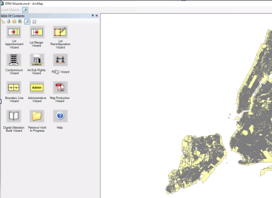

# geodatabase-taxmap-toiler

The New York City Department of Finance Digital Tax Map is a system of editing and publishing components that is the tax map of record.  The Department of Finance has historically used customized ArcGIS Desktop Software, aka "The Wizards," to edit an ESRI Enterprise Geodatabase hosted at the NYC Office of Technology and Innovation (formerly DoITT).



The goal of this repository is to help migrate the database components supporting Department of Finance editing from a legacy 10.2 ESRI User-Schema Enterprise Geodatabase on Oracle 11g to a supported ESRI Enterprise Geodatabase on Oracle 19c.  We will pay no mind to requirements like publishing to the web application or NYC Open Data.

The code is mainly scripts and convenience wrappers to [geodatabase-toiler](https://github.com/mattyschell/geodatabase-toiler), accounting for some of the patterns in this application that the geodatabase-toiler does not manage.  Friends, this our taxmap toiling in an ESRI Enterprise Geodatabase, our rules, the trick is never to be afraid.


# Tests

Basic stuff here. Requires a scratch Oracle database schema.

```bat
> set SDEFILE=X:\yyy\zzz.sde
> set PYTHONPATH=C:\gis\geodatabase-toiler\src\py;C:\gis\geodatabase-taxmap-toiler\src\py;%PYTHONPATH%
> testall.bat
```

# Migrate DOF_TAXMAP 

The sample will delete everything on the destination, then import all. Edit the sample and rename it for any migration.

Edit the inventories under src/resources.  

* Cadastral
* featureclasses
* tables

```bat
> sample_import.bat 
```

## Schema Inventory

* DOF_EDITOR
    * Has the DOF_TAXMAP_EDITOR role
    * Empty except for ESRI keyset and log detritus
* DOF_TAXMAP 
    * See "DOF_TAXMAP Data Inventory" section below
* JTX_ADMIN 
    * 5 GB, migration TBD
* MAP_VIEWER
    * We grant select on everything in the data inventory
    * Unknown how this is actually used

## Role Inventory

* DOF_TAXMAP_EDITOR
    * Granted to DOF_EDITOR
    * We will ignore this role for the proof of concept test

## Extraneous Schema/Role Inventory: Ignore For Now

These appear to be convenience cruft that are not part of the
required application setup.

* Schemas
    1. DOF_READONLY
* Roles
    1. DOITT_DTM_VIEWER
    2. TAXMAP_VIEWER


## Versions

This repository will not create versions. For reference:  

* DEFAULT
    * DOF_PRODUCTION
        * DOF_EDITOR.*

## DOF_TAXMAP Data Inventory

Mixed case ESRI feature classes exist where indicated.

### Spatial Data

Registered as versioned and is edited.

* "Cadastral" feature dataset
    * Boundary
    * Lot_Face_Possession_Hooks
    * Misc_Text
    * Possession_Hooks
    * Tax_Block_Polygon
    * Tax_Lot_Centroid
    * Tax_Lot_Face
    * Tax_Lot_Polygon
    * Relationship Classes
        * Polygon_Face_Relationship
    * Topology
        * Possession_Hook_Topology
        * Tax_Lot_Topology

### Tables

Some of these tables store Portable Document Formatted maps as Binary Large Objects and are large.  To keep the migration process simple we migrate them with arcpy but this is not ideal. 

Tables with mixed-case names are geodatabase-registered and versioned on the legacy source database. The wizards appear to edit some tables directly without using the geodatabase.  After importing these tables they will be registered on the target Geodatabase but only those indicated Versioned=Y below will be versioned.

|  | Name | Registered | Versioned |
| ---- | ---- | ---- | ---- |
| 1. | AIR_LABEL | N | N |
| 2. | Air_Rights_Condos | Y | Y |
| 3. | Air_Rights_Holders | Y | Y |
| 4. | Air_Rights_Lots | Y | Y |
| 5. | Condo | Y | Y |
| 6. | CONDO_LABEL | N | N |
| 7. | Condo_Units | Y | Y |
| 8. | Conversion_Exceptions | Y | Y |
| 9. | Conversion_Log (empty) | Y | Y |
| 10. | DAB_ACTION_DEFINITION | N | N |
| 11. | DAB_AIR_RIGHTS | N | N |
| 12. | DAB_AIR_RIGHTS_DEFINITION | N | N |
| 13. | DAB_BOUNDARY_LINE | N | N |
| 14. | DAB_CONDO_CONVERSION | N | N |
| 15. | DAB_CONDO_UNITS | N | N |
| 16. | DAB_DOMAINS | N | N |
| 17. | DAB_REUC | N | N |
| 18. | DAB_SUBTERRANEAN_RIGHTS | N | N |
| 19. | DAB_TAX_LOTS | N | N |
| 20. | DAB_WIZARD_TRANSACTION | N | N |
| 21. | DTM_USER_MAINT | N | N |
| 22. | DTM_WORK_IN_PROGRESS | N | N |
| 23. | FINAL_ASMT | N | N |
| 24. | GWC_CUSTOM | N | N |
| 25. | HAB | N | N |
| 26. | MAP_INSET_LIBRARY | N | N |
| 27. | MAP_LIBRARY | N | N |
| 28. | REUC_Lots | Y | Y |
| 29. | SUB_LABEL | N | N |
| 30. | Subterranean_Lots | Y | Y |


### Views

The editing wizards use no views.  

Use caution if examining views on the source environments.  One view (condo_unit) is so poorly defined that previewing it in ESRI software will fire off automated database alerts!

### Relationship Classes

One relationship class lives under the Cadastral feature dataset, see above.  We will create 12 relationship classes. 

Relationship classes listed in resources\relationshipclasses will be deleted.  11 are listed, the 12th relationship class accompanies the Cadastral feature dataset deletion.  Relationship class creation requires 12 individual calls in sample_import.bat to createrelationshipclass.py.  The organization here is meh, I know.

1. Air_Rights_Lots_Holders_Relationship
2. Condo_Air_Rights_Relationship
3. Condo_Condo_Unit_Relationship
4. Tax_Lot_Air_Rights_Holders_Relationship
5. Tax_Lot_Air_Rights_Relationship
6. Tax_Lot_Condo_Relationship
7. Tax_Lot_Condo_Unit_Relationship
8. Tax_Lot_Conversion_Exceptions_Relationship
9. Tax_Lot_Conversion_Log_Relationship
10. Tax_Lot_REUC_Relationship
11. Tax_Lot_Subterranean_Relationship

### Spatial Data: Reference Used by the Wizards

Best to include these, the Wizards expect them even if they are not edited or explicitly read.  


1. "DCP" feature dataset
    * Boro_Boundary
    * Community_Districts
    * Non_Tax_Block_polygon
    * Non_Tax_Lot_Polygon
    * Shoreline_Polygon
2. LION_SUBSET_SDE
3. TRANSPORTATION_LINE_SDE
4. BUILDING
5. OPEN_SPACE_SDE
6. HYDRO_SDE 

### Spatial Data: Not Required Reference 

We will ignore other reference data.   But for reference here's a list.

1. BOROUGH_POINT
2. CSCL_CENTERLINE
3. HYDRO
4. LAND
5. SHORELINE
6. TRANSPORTATION_STRUCTURE

## ESRI Workflow Manager

Workflow manager data is in the JTX_ADMIN schema.

* JTX_ACTIVITY_TYPES
* JTX_AUX_PROPS
* JTX_CONN_INFO
* JTX_DATABASES
* JTX_DATABASE_SCHEMA
* JTX_DELETED_OBJECTS
* JTX_HISTORY
* JTX_HISTORY_DATASETS
* JTX_HISTORY_SESSIONS
* JTX_HOLD_TYPES
* JTX_JOBS
* JTX_JOBS_AOI - spatial
* JTX_ADMIN.JTX_JOBS_AOI - spatial
* JTX_JOBS_DB
* JTX_JOBS_POI
* JTX_JOB_ATTACHMENTS
* JTX_JOB_BLOB
* JTX_JOB_DATA
* JTX_JOB_DEPENDENCIES
* JTX_JOB_FILTERS
* JTX_JOB_FILTER_XREF
* JTX_JOB_HOLDS
* JTX_JOB_QUERIES
* JTX_JOB_STEP
* JTX_JOB_STEP_XREF
* JTX_JOB_TYPES
* JTX_JOB_TYPE_BLOB
* JTX_JOB_TYPE_MAP_DOC
* JTX_JOB_TYPE_PROPERTIES
* JTX_JOB_TYPE_REL_CLASSES
* JTX_JOB_TYPE_STEP
* JTX_JOB_TYPE_STEP_XREF
* JTX_LAYERS
* JTX_LOGIN_INFO
* JTX_MAP_STORE
* JTX_NOTIFICATIONS
* JTX_NOTIFICATION_SUBSCRIBERS
* JTX_OBJECT_PERMISSIONS
* JTX_PRIORITY
* JTX_PRIVILEGES
* JTX_PRIV_XREF
* JTX_PROPERTIES
* JTX_PROP_RELATIONSHIPS
* JTX_QUERY_CONTAINERS
* JTX_QUERY_OWNERS
* JTX_REPLICATION_INFO
* JTX_REPORTS
* JTX_REPORT_QUERIES
* JTX_REV_SESSION_XREF
* JTX_SPAT_NOTIF_LAYERS
* JTX_SPAT_NOTIF_MATCHES
* JTX_SPAT_NOTIF_RULES
* JTX_SPAT_NOTIF_RULE_CONDITION
* JTX_STATUS
* JTX_STATUS_HIST
* JTX_STEP_COMMENTS
* JTX_STEP_STATUS
* JTX_STEP_TYPE
* JTX_TASK_ASSISTANT_WORKFLOWS
* JTX_TOKEN_PARSERS
* JTX_TRANSACTIONS
* JTX_TRANSACTIONS_TEMP
* JTX_TRANSACTION_SESSIONS
* JTX_USERS
* JTX_USER_GROUPS
* JTX_USER_GROUP_JOB_FILTERS
* JTX_USER_GROUP_XREF
* JTX_WORKFLOW_STORE


