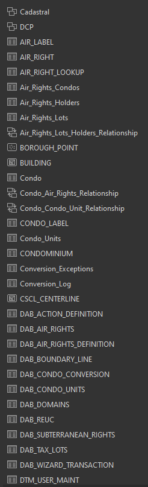
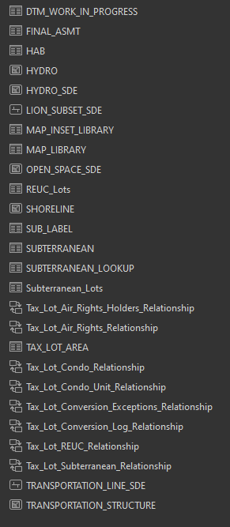

# Export to File Geodatabase

Final export completed on November 22, 2023 Using ArcGIS Pro 3.0.0. Started at 9:15 am, upload to external site complete by 2pm.

This is the export procedure we will use in the taxmap cutover from the legacy 10.2 Enterprise Geodatabase on Oracle 11g to the new application in Azure.  We will export required data from the dof_taxmap schema to a file geodatabase using copy and paste in ArcGIS Pro's catalog pane. Yes, that's right.

Use ArcGIS Pro for all steps.  ArcCatalog (32 bit) seems to crash unexpectedly at various stages of export. 

REMINDER: Focus and do not execute deletes unless absolutely necessary.  A delete clicked on the production database is a risk here.   

## Well defined steps

1. Create the empty output file geodatabase

2. Copy-paste the Cadastral feature dataset from source to target

3. Copy-paste the DCP feature dataset from source to target

4. Use Table2table to export the three big tables with binary large object columns. 

* HAB
* MAP_INSET_LIBRARY
* MAP_LIBRARY

## Chaos defined steps

Copy and paste the rest to fill in the missing datasets.  Refer to the screenshots below including this important one.

Do not touch the condo_unit view in the source database.  It is so horribly defined that viewing it will degrade the database and fire off alerts to DBA blackberries.   

Copying database views into a file geodatabase materializes the views as permanent tables. Make sure the users of this geodatabase understand this.

Source Views

* AIR_RIGHT          
* AIR_RIGHT_LOOKUP   
* CONDOMINIUM        
* SUBTERRANEAN       
* SUBTERRANEAN_LOOKUP

Good file geodatabase screenshots:

Output geodatabase size estimates:

* uncompressed: 38 GB
* compressed: 31 GB

