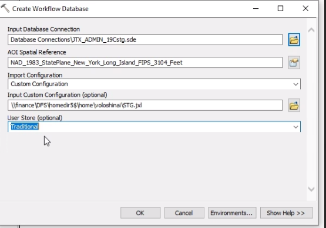
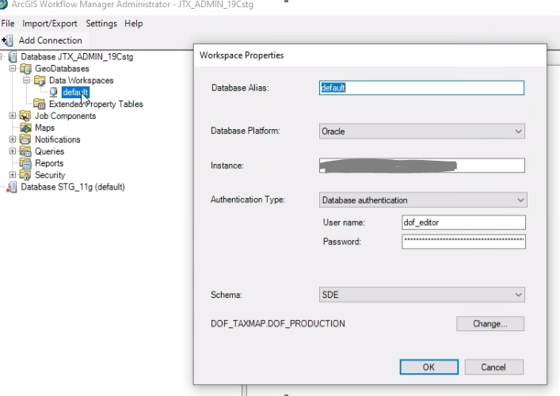
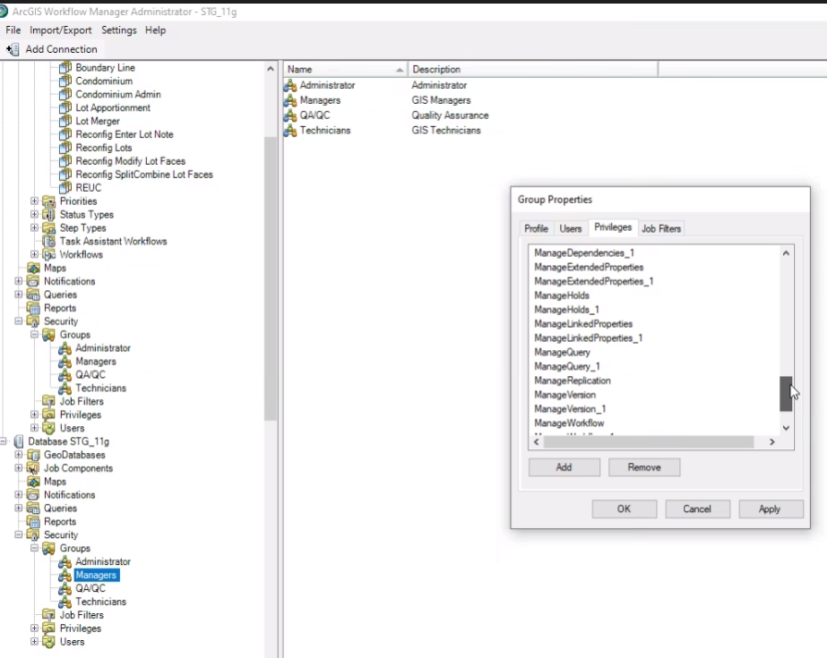

# geodatabase-secret-jtx_admin-toiler

Using ArcGIS Desktop 10.6.1

1. Start with an empty JTX_ADMIN schema on the target 19c database

2. From Workflow Manager Administrator (11g source) “Import/Export > Export Configuration”  In the "schema" dropdown choose DOF_TAXMAP

3. From ArcCatalog use the “Create Workflow Database” tool to create an empty workflow database in the JTX_ADMIN schema on the 19c target.  The custom configuration is the .jxl file created in step 2.

4. Close and re-open Workflow Manager Administrator.

5. From Workflow Manager Administrator (19c target) create the default workspace  

6. The next step is officially named the “not so fun step.”  From Workflow Manager Administrator manually compare the jobs, steps, workflows, users, etc ensuring that all from the source 11g database imported to the 19c target.  The last set to compare should be “Maps.”

7. If anything is missing we can use the same “Import/Export > Export Configuration” pattern for individual items in the tree.

8. Export Jobs. From the Workflow Manager toolbox in ArcCatalog select the “Export Jobs” tool to export from the source.  Then import to 19c.